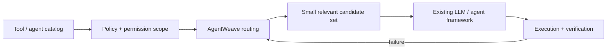

# AgentWeave — Route Before You Reason

[](https://github.com/sauravsingla/agentweave/actions/workflows/ci.yml)
[](https://github.com/sauravsingla/agentweave/actions/workflows/sdk-interop.yml)
[](https://github.com/sauravsingla/agentweave/actions/workflows/deep-proof.yml)
[](https://github.com/sauravsingla/agentweave/actions/workflows/paper-quality.yml)
[](LICENSE)
[](CITATION.cff)

**Pre-inference routing for tool-rich LLM and multi-agent systems.**

> **Your agent has 100+ tools. Don't make the model reason over all of them. Route first, then reason over a smaller relevant action space.**

AgentWeave is an open-source **routing and reliability layer** for MCP, tool-rich LLM applications, and multi-agent systems. It reduces the tools or agents visible to the model before inference while keeping **policy, provenance, recovery, and execution explicit**.

**70.18% fewer tools exposed · 61.70% fewer input tokens · 50.95% lower mean local-model latency**  
**MCP · A2A · LangGraph · AutoGen · policy-aware routing · recovery · reproducible evaluation**

**Quick links:** [30-second start](#30-second-start) · [Results](#results-at-a-glance) · [MCP](docs/MCP_INTEGRATION.md) · [A2A](docs/A2A_COMPATIBILITY.md) · [Architecture](#architecture) · [Reproduce](docs/BFCL_REPRODUCE.md) · [Paper](https://arxiv.org/abs/2608.23078)

> **Want to try it?** Install AgentWeave and run the test suite in under a minute → [30-second start](#30-second-start)

```text
100+ tools / agents
       ↓
permission + policy scope
       ↓
AgentWeave task-aware routing
       ↓
small relevant candidate set
       ↓
existing LLM / agent framework
       ↓
execution + verification
```

AgentWeave does **not** replace MCP, LangGraph, AutoGen, A2A, or your model. It sits in front of them and reduces the decision space.

## When should I use AgentWeave?

AgentWeave is designed for systems where a model or agent can access a **large heterogeneous catalog of tools or specialist agents** and the model-visible action space should be reduced before inference.

Typical use cases include MCP servers with large tool catalogs, multi-agent specialist pools, enterprise capability catalogs, A2A ecosystems, LangGraph workflows, AutoGen teams, marketplaces, cloud agents, and edge runtimes.

If deterministic role, tenant, permission, or policy scope already reduces the catalog sufficiently, use that first. AgentWeave's task-aware routing is for the remaining cases where the model-visible action space is still too large.

## What is different?

AgentWeave brings four concerns into one routing layer:

- **Route before reasoning:** construct a smaller relevant action space before the model call.
- **Policy and trust first:** apply authorization, placement, trust, provenance, and governance constraints explicitly.
- **Failure-aware execution:** detect failures, re-rank alternatives, recover, and resume durable workflows.
- **Auditable evaluation:** keep benchmark protocols, weak results, negative results, and scientific claim boundaries explicit.

## Results at a glance

> The headline BFCL result is a **BFCL-derived routing-pressure experiment, not an official full BFCL leaderboard score**.

| Evidence | Verified result |
|---|---|
| BFCL routing-pressure v6 | **6/48 native task successes vs 0/48 for matched all-tools, random top-8, and semantic top-8 baselines** |
| Tool exposure | **70.18% fewer** than all-tools |
| Input tokens | **61.70% fewer** than all-tools |
| Mean local-model latency | **50.95% lower** than all-tools |
| Statistical test | Exact McNemar **p = 0.03125** |
| AgentBench | **52.0% Hit@1; 89.9% accuracy on committed routes at 46.3% coverage** |
| ToolBench | **35.8% Hit@1; 47.5% Hit@3; 53.8% Hit@5; MRR 0.440** |
| AgencyBench | Up to **92.2% cumulative-context Hit@3** |
| Executable team benchmark | **100% completion; 0.937 mean quality; 100% recovery** in the preregistered repeated-seed study |
| Synthetic scale exercised | Up to **1,000,000 agents** |

The BFCL-derived v6 study uses 48 BFCL V4 `multiple` tasks, 16-tool pressure, and a pinned local model. The absolute **12.5% native task success rate** is intentionally retained alongside the relative improvements.

[Reproduce the study](docs/BFCL_REPRODUCE.md) · [Frozen v6 results](BFCL_V6_RESULTS.md) · [Read the paper](https://arxiv.org/abs/2608.23078)

## Start with your stack

| If you use... | Start here |
|---|---|
| **MCP / large tool catalogs** | [`docs/MCP_INTEGRATION.md`](docs/MCP_INTEGRATION.md) |
| **LangGraph** | [`docs/LANGGRAPH_INTEGRATION.md`](docs/LANGGRAPH_INTEGRATION.md) |
| **AutoGen** | [`docs/AUTOGEN_INTEGRATION.md`](docs/AUTOGEN_INTEGRATION.md) |
| **A2A agents** | [`docs/A2A_COMPATIBILITY.md`](docs/A2A_COMPATIBILITY.md) |
| **BFCL-derived evaluation** | [`docs/BFCL_REPRODUCE.md`](docs/BFCL_REPRODUCE.md) |
| **API compatibility** | [`docs/API_COMPATIBILITY.md`](docs/API_COMPATIBILITY.md) |

## 30-second start

```bash
git clone https://github.com/sauravsingla/agentweave.git
cd agentweave
python -m pip install -e '.[dev]'
pytest -q
```

Minimal example:

```python
import asyncio
from agentweave import AgentWeave, AgentProfile, Capability, InMemoryA2AAdapter

async def main():
    bus = InMemoryA2AAdapter()
    weave = AgentWeave(a2a=bus, db_path=':memory:')

    agent = AgentProfile(
        'research-1',
        'Research Agent',
        [Capability('research', .9, True)],
    )

    weave.register(agent)
    bus.register_handler(
        'research-1',
        lambda task: {'result': 'evidence-backed finding'},
    )

    result = await weave.solve(
        'Research and verify this topic',
        rounds=1,
        semantic_verify=True,
    )
    print(result)

asyncio.run(main())
```

Useful CLI commands:

```bash
agentweave version
agentweave doctor
agentweave graph-stats
agentweave plugins
agentweave --config agentweave.yaml config-check
agentweave solve --semantic-verify "Research and verify this topic"
```

## Core capabilities

- **Pre-inference routing:** construct a smaller model-visible action space before the model call.
- **Requirement-aware selection:** infer task capabilities and rank matching agents/tools.
- **Policy and placement:** scopes, jurisdiction, residency, locality, risk tiers, human approval, and tool restrictions.
- **Contextual trust:** identity, validation, freshness, historical outcomes, governance, and reputation.
- **Team optimization:** capability coverage, redundancy, diversity, cost, latency, and communication overhead.
- **A2A interoperability:** external SDK compatibility and protocol-level proof paths.
- **Runtime recovery:** detect failure, update trust, re-rank alternatives, and fail over.
- **Durable workflows:** checkpoint multi-step work and resume without replaying completed steps.
- **Verification and consensus:** contradiction, uncertainty, semantic verification, result validation, and conflict handling.
- **Observability and auditability:** structured traces, audit events, metrics, and explicit selection evidence.

## Integration model

```text
MCP       → policy/capability filtering → AgentWeave → model-visible tools
LangGraph → state → AgentWeave routing node → selected specialists → downstream nodes
AutoGen   → task → AgentWeave → selected participants → AutoGen execution
A2A       → discovery/communication substrate → AgentWeave selection + execution
```

For A2A, the proof suite launches independent upstream SDK agents and exercises discovery and invocation across Python, Go, JavaScript, and Java. **Current proof:** JSON-RPC MUST-level TCK. See [`docs/A2A_COMPATIBILITY.md`](docs/A2A_COMPATIBILITY.md).

## Research evidence

AgentWeave keeps routing, process-verification, executable-outcome, and BFCL-derived evidence separate rather than combining unlike metrics into one score.

| Evidence | Evaluation problem | Current result |
|---|---|---|
| **AgentBench** | Blind specialist selection | **52.0% Hit@1**; **89.9% accuracy on committed routes** at **46.3% coverage** |
| **ToolBench** | Tool/API retrieval over 4,856 APIs | **35.8% Hit@1**, **47.5% Hit@3**, **53.8% Hit@5**, MRR **0.440** |
| **AgencyBench** | Capability-family routing | **57.0% zero-shot Hit@1**; **67.2% cumulative-context Hit@1**; **92.2% cumulative-context Hit@3** |
| **AgentProcessBench** | Label-blind process verification | **55.88% step micro accuracy**; **38.30% first-error accuracy** across **1,000 trajectories / 8,509 steps** |
| **BFCL routing-pressure v6** | Native BFCL validity under augmented tool pressure | **6/48 = 12.5% AgentWeave vs 0/48 for all matched baselines**, exact McNemar **p = 0.03125** |
| **Executable team benchmark** | Controlled multi-agent completion and recovery | **100% completion**, **0.937 mean quality**, **100% recovery** in the preregistered repeated-seed study |

### Frozen-router generalization

New router versions are evaluated on newly introduced untouched holdouts and then frozen. Percentages across rows are not directly comparable; the valid comparison is the previous router versus the new router on the same new holdout.

| Evaluation | Tasks | Same-holdout result |
|---|---:|---:|
| Frozen original router | 499 | **15.6% Hit@1**; majority baseline 39.9% |
| Router V2 | 72 | 52.8% → **54.2% Hit@1** |
| Router V3 | 72 | 31.9% → **76.4% Hit@1** |
| Router V4 | 72 | 72.2% → **91.7% Hit@1** |
| Router V5 | 72 | 38.9% → **77.8% interactive Hit@1** |
| Router V6 | 72 | 37.5% → **59.7% interactive Hit@1** |
| Router V7 | 72 | 73.6% → **91.7% search-family Hit@1** |

## Scientific boundaries

- Scored studies are frozen after scoring.
- Weak and negative results are retained.
- New router versions use newly introduced holdouts.
- BFCL-derived evidence is not described as an official BFCL leaderboard result.
- Controlled synthetic execution is not described as production performance.
- Routing accuracy is not presented as native task completion.
- Changes to model, sample, router, distractors, or protocol require a new study.

The paper-quality evaluation also retains the post-hoc result that simple zero-shot embedding baselines outperform the original frozen AgentWeave router on the already-observed General-AgentBench set.

## Reliability, security, and scale

AgentWeave supports failure detection, trust updates, re-ranking, replacement selection, retry, and durable checkpoint/resume workflows.

The proof suite covers malicious Agent Cards, prompt injection, data exfiltration, SSRF/link-local access, tool abuse, spoofing, Sybil/collusion, reputation poisoning, Byzantine disagreement, malformed results, and timeouts. It also exercises Docker isolation, JWT Verifiable Credentials, revocation, key rotation, KMS/HSM boundaries, PostgreSQL concurrency, governance constraints, and chaos scenarios.

A passing proof is evidence for the configured test runtime; it is not a formal security, HA, hardware-attestation, or compliance certification.

Synthetic scalability runs extend to **1,000,000 agents**. Negative measurements are preserved as part of the evidence record.

## Architecture



AgentWeave keeps routing as an explicit systems stage rather than embedding selection invisibly inside downstream model reasoning.

## Evidence & documentation

| Area | Documentation |
|---|---|
| MCP | [`docs/MCP_INTEGRATION.md`](docs/MCP_INTEGRATION.md) |
| A2A interoperability | [`docs/A2A_COMPATIBILITY.md`](docs/A2A_COMPATIBILITY.md) |
| LangGraph | [`docs/LANGGRAPH_INTEGRATION.md`](docs/LANGGRAPH_INTEGRATION.md) |
| AutoGen | [`docs/AUTOGEN_INTEGRATION.md`](docs/AUTOGEN_INTEGRATION.md) |
| BFCL reproduction | [`docs/BFCL_REPRODUCE.md`](docs/BFCL_REPRODUCE.md) |
| API compatibility | [`docs/API_COMPATIBILITY.md`](docs/API_COMPATIBILITY.md) |
| Research paper | [`PAPER.md`](PAPER.md) · [arXiv:2608.23078](https://arxiv.org/abs/2608.23078) |
| Research citation | [`CITATION.cff`](CITATION.cff) |

## Project status

AgentWeave is an **active research and engineering project**. APIs and evaluation protocols may evolve; pin a release or commit when using results in reproducible experiments.

The strongest current evidence is around **pre-inference routing, interoperability, recovery, and reproducible evaluation**. Published benchmark claims remain scoped to their documented models, datasets, protocols, and test environments.

## Contributing

**External reproductions are especially valuable.** If you test AgentWeave on your own MCP server, tool catalog, agent framework, or benchmark, please open an issue or PR with what worked, what failed, and the catalog size.

Contributions are welcome around routing, integrations, benchmark scenarios, security tests, interoperability reports, evaluation datasets, and documentation.

See [`CONTRIBUTING.md`](CONTRIBUTING.md), [`SECURITY.md`](SECURITY.md), [`CHANGELOG.md`](CHANGELOG.md), and [`CITATION.cff`](CITATION.cff).

## Paper

**AgentWeave: Routing Before Reasoning for Efficient Function Calling in Tool-Rich Language Models**  
[arXiv:2608.23078](https://arxiv.org/abs/2608.23078) · [`PAPER.md`](PAPER.md)

If you use AgentWeave in research, please cite the paper and repository.

## License

Apache-2.0
